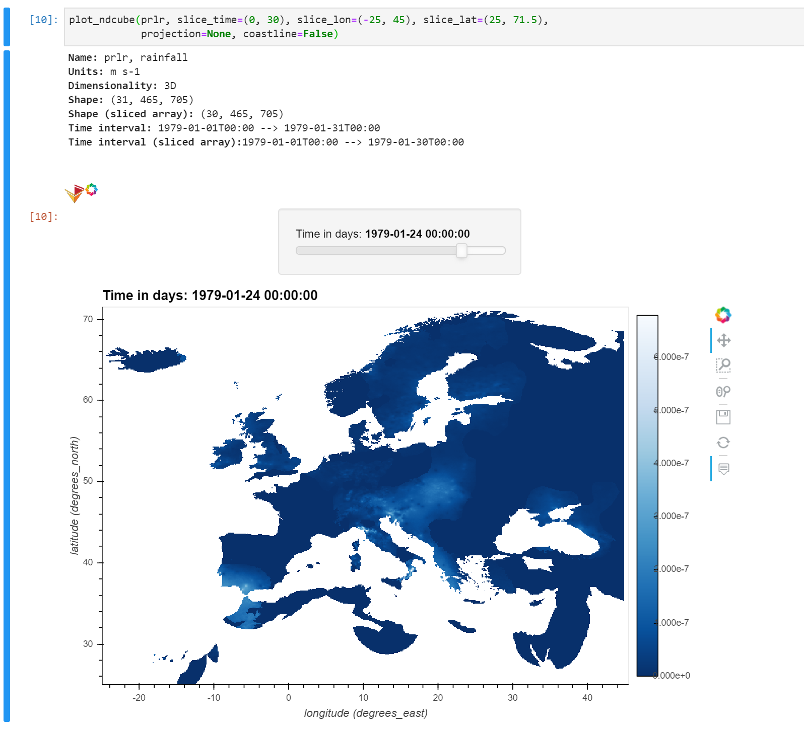
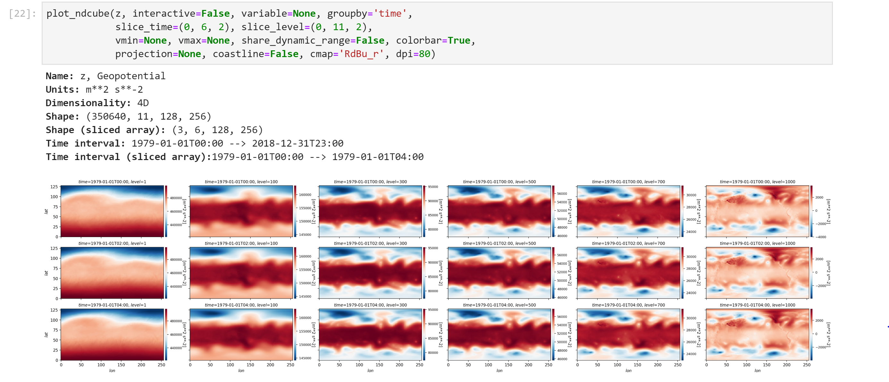

# Welcome to the repository of ecubevis

`ecubevis`: Earth CUBE VISualization with Python. Intended for the interactive exploration of n-dimensional (2D, 3D or 4D spatio-temporal) arrays on Jupyterlab. Supports both ``xarray.Dataset/DataArray`` (with metadata) or ``numpy.ndarray`` objects. In both cases, the dimensions expected are [lat, lon] for 2D arrays, [time, lat, lon] for 3D arrays or [time, level, lat, lon] for 4D arrays, but for a ``numpy.ndarray`` object the dimensions are implicit, since it lacks metadata. 

## For BSC-ES users

To use `ecubevis` on the POWER-CTE cluster (P9), use the following modules to solve the dependencies:

```
module use /gpfs/projects/bsc32/software/rhel/7.4/ppc64le/POWER9/modules/all/
module load Cartopy/0.17.0-foss-2018b-Python-3.7.0
module load jupyterlab/3.0.9-foss-2018b-Python-3.7.0
```

The modules should have the same names on Nord3 (just "use" the Nord3 modules repository). 

That's it, you are ready to import `ecubevis` from this folder (assumining you've clones or downloaded this git repository). 

## How to use

... WIP ... 

## Screenshots

`ecubevis` will allow you to:

* Create interactive plots of in-memory 3D and 4D `xarray` Datasets/Dataarrays. The sliders, thanks to `hvplot`, allow to easily explore the data as 2D arrays across the time and vertical level dimensions.




* Create static mosaics of in-memory 3D and 4D `xarray` Datasets/Dataarrays.


